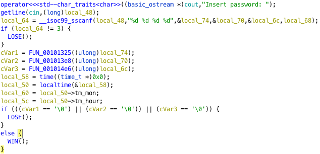
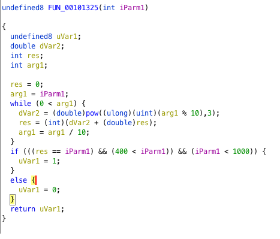
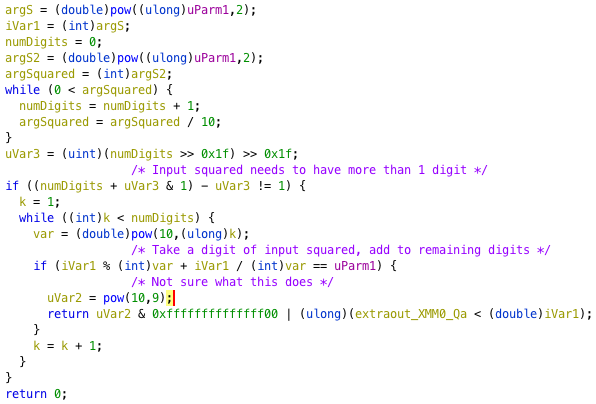
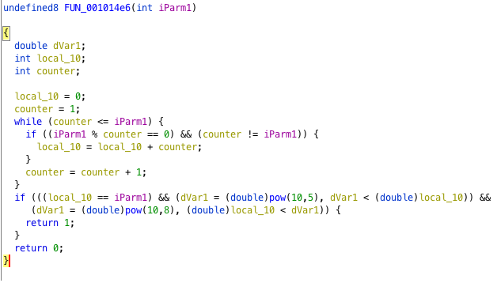
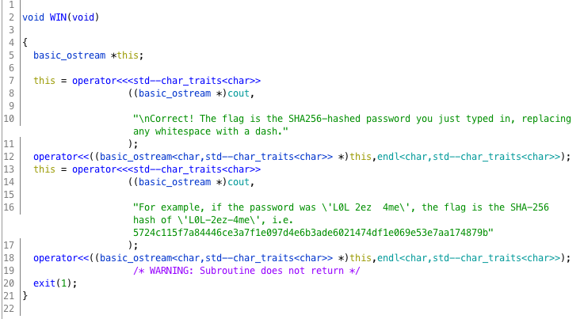

# Three Trials

>Reverse the binary, understand the conditions, dust out your math textbooks and solve the trials!

A single  is provided.

## Static Analysis with Gidra

Importing the binary with Gidra and decompiling gives us a gist of what the program does.



From the main function, we see that the program accepts 3 integer parameters. Each of these parameters is passed as an argument to a function. The goal is for all  three functions to return a non-zero value, otherwise ``Wrong!`` is printed and the program terminates. 

### Function1


The core loop is straightforward: Each digit of the input is sequentially extracted, raised to the power of 3 and added to the running sum. The function then checks that ``sum of digits ^ 3 == input`` and ``400 < input < 1000 ``.

```python
for k in range(400,800):
    res=0
    val=k
    while(val>0):
        res+=pow((val%10),3)
        val//=10
    if(res==k):
        arg1=k
        print("arg 1 =",arg1)
        break
```
``407`` is the only value for parameter 1 that satisfies the constraints.
### Function2


Note that ``uvar3`` evaluates to ``0``, and thus ``(numDigits + uVar3 & 1) - uVar3 != 1`` simplifies to ``numDigits != 1``, i.e. ``input ^ 2 > 9 ``.
The core loop is a bit more complex than that of the first function: For each digit of ``input ^ 2``, it checks if the sum of that digit and the rest of ``input ^ 2`` is equal to ``input`` (e.g. ``24 ^ 2 = 484, 484 -> 8 + 44 = 52, 24 != 52``). If so, the function returns. Unfortunately, due to deficiencies in decompilation, it is not clear what value exactly is returned.

```python
for i in range(1,100000):
    k=pow(i,2)
    if(k<10):
        continue
    else:
        res=int(str(k)[::-1][:-1][::-1])+int(str(k)[0])
        if(res==i):
            arg2=i
            print("arg 2 =",arg2)
```
Setting an arbitrary upper bound for the input, we observe that there are multiple potential candidates for parameter 2. Hence some testing will have to be done to determine the correct one.

### Function3


The core loop simply finds the sum of all factors of the input, excluding itself. It then checks that `` 10 ^ 5 < input < 10 ^ 8 `` and ``sum of factors == input `` A number that satisfies the second constraint is also known as a **perfect number**. A list of known perfect numbers is available at [OEIS](https://oeis.org/A000396). The only number that satisfies the first constraint is ``33550336``, which is hence parameter 3.


## Dynamic Analysis
Trying the potential candidates for the second parameter in order, we find that ``38962`` is accepted. The correct set of parameters is hence ``407 38962 33550336``


Doing as instructed:
```python
>>> flag=b"407-38962-33550336"
>>> m=hashlib.sha256()
>>> m.update(flag)
>>> m.digest().hex()
'5137e2ead70710512aa82dfca8727c4eb6803637143a9c2f0c7596ab00352a69'
```
The flag is therefore ``DSO-NUS{5137e2ead70710512aa82dfca8727c4eb6803637143a9c2f0c7596ab00352a69}``


## Additional Info
Instead of solving the first two problems via bruteforce, we can find the sequences on google. \
For the first trial, googling 'sum of cubes of digits equal to itself' will lead to finding out the problem happens to be a special case of the Armstrong numbers (for three digits), which will allow us to find that 407 is the only such number in the range 400 to 1000. \
For the second trial, some copying of initial terms from our bruteforcer allows us to find the Kaprekar numbers on OEIS, which happen to describe the sequence of numbers satisfing the very condition for function 2! 


