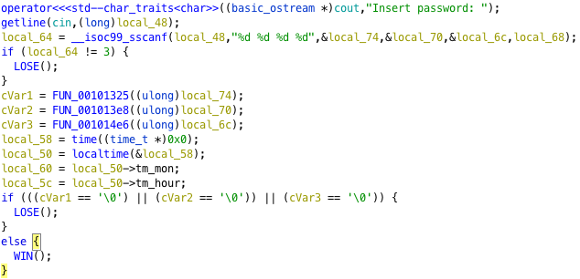
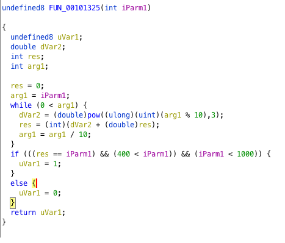
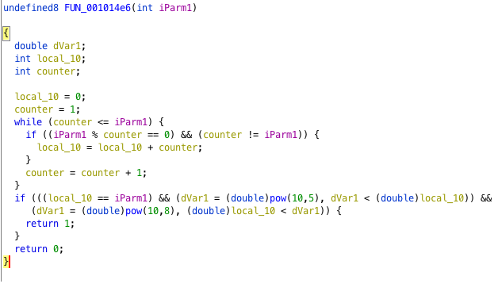

# Three Trials

>Reverse the binary, understand the conditions, dust out your math textbooks and solve the trials!

A single binary is provided.

## Static Analysis with Gidra

Importing the binary with Gidra and decompiling gives us a gist of what the program does.



From the main function, we see that the program accepts 3 integer inputs. Each of these inputs is passed as an argument to a function. The goal is for all functions to return a non-zero value, otherwise ``Wrong!`` is printed and the program terminates. 

### Function1


The first function requires that ``400 < input < 1000 `` and that `` input = sum of each digit ^ 3``

### Function2


The second function requires that ``len(input ^ 2) > 1`` and that at least one of the digits of ``input ^ 2``, when removed and added to the number represented by the remaining digits, is equal to ``input``

### Function3


The third function requires that `` 10 ^ 5 < input < 10 ^ 8 ``, and that the input is a **perfect number**. A list of known perfect numbers is available at [OEIS](https://oeis.org/A000396).
## Python solver


## Dynamic Analysis
Trying all the potential candidates for the second argument, we find that ``38962`` is accepted. The correct input is hence ``407 38962 33550336``

```python
>>> flag=b"407-38962-33550336"
>>> m=hashlib.sha256()
>>> m.update(flag)
>>> m.digest().hex()
'5137e2ead70710512aa82dfca8727c4eb6803637143a9c2f0c7596ab00352a69'
```
The flag is therefore ``DSO-NUS{5137e2ead70710512aa82dfca8727c4eb6803637143a9c2f0c7596ab00352a69}``


## Additional Info
Instead of solving the math problems via bruteforce, we can find the sequences on google. \
For the first trial, googling 'sum of cubes of digits equal to itself' will lead to finding out the problem happens to be a special case of the Armstrong numbers (for three digits), which will allow us to find that 407 is the only such number in the range 400 to 1000. \
For the second trial, some copying of initial terms from our bruteforcer allows us to find the Kaprekar numbers on OEIS, which happen to describe the sequence of numbers satisfing the very condition for function 2!  \


