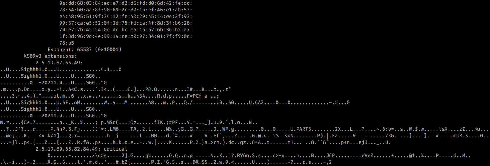

# Sighhh


We are given a DER file containing binary data, and a hint about using a private key to encrypt in a public key cryptosystem. 

DER files are typically hex encoded certificates in ASN.1 format containing cryptographic data, which are usually used for encrypting connections to a website or organisation for example, or for verifying the data sent from a website is legitimate.

Here we first parse the certificate with the [OpenSSL](https://www.openssl.org) command line utility (as one typically does with certifcates such as these DER files).

> `openssl x509 -inform der -in sighhh.der -text`

 


Here we find out that the file contains information about the RSA cryptosystem.

 

As well as some fields containing what seems to be gibberish. Upon closer inspection there seems to be some structure to this binary data, containing some strings at appear at the start of the DER file itself as well. At this point, I decided to use [CyberChef](https://gchq.github.io/CyberChef/) to process the file more interactively rather than through CLI.


Upon taking the PEM output from openssl gives in addition to parsing the DER file (which in hindsight was not necessary as I could have just uploaded the file directly and processed it by first converting to hex), and converting it to readable format using the inbuilt recipes (PEM to hex, Parse ASN.1 hex string), we find that luckily, the gibberish was also in ASN.1 format has been parsed to further sets of moduluses and exponents for RSA, as well as an additional field corresponding to each (presumably the ciphertexts mentioned in the challenge description; see [message.txt](message.txt) for full output).

Now given the challenge description, if the ciphertexts are encrypted with the private key instead of the public key, to retrieve the original message all we have to do is to exponentiate by the public key (under modulo N).

(In RSA, a ciphertext c is normally generated from a message m by taking c = m<sup>e</sup> (mod N), where e is the public key and N is the modulus. The message can be retrieved by taking c<sup>d</sup> (mod N) = (m<sup>e</sup>)<sup><sup>d</sup></sup> (mod N) = m<sup>e*d</sup> (mod N) = m (mod N), where d is the private key. Here since they use the private key to encrypt initially, we are given c = m<sup>d</sup> (mod N), which allows us to exponentiate by e and retrieve the message)

So I copy the ciphertext and modulus pairings to a quick script to decrypt the ciphertexts.

```n1=int('00aeb08f314263a2ef6d8d651092b64ededc3f96f0828b71a55ebdbc3de1041fe98b53cdde3c1add3d302420560fdaa45e52c80298a7d5036e8b424636cef36d87fa646a4e5635c8b5cbd310a2d919a52ae2adb3b47bd7ac7ab6dc3acfd257adfe2ed0f10e02b453267c3173afec4b9e0e3975ca2b07cd46085bddf561b8af547ef656727d6965fab3c4fde2b50259337b1a2eb290b1b356e490e0eca21bd7b1fd8a7db1b50add680384ece7d2d5fdd06d42fedc2854b0aa8f90692c801bef46e1ab53e44895519f3412fe40294514ee2f939937cae5520f3d75fdca4f8d3fb62670e77b45540edcbcea16676b36b2a71f3d969d4e9914ceb09784017ff90c78b5',16)
c1=int('30ea0eeedfd9db2d0fa4c9e4c809c5785c713e73be94ab832e325d94479b9bcc807163ae8ca588cdcb4fb551e29b6fd2705fc2e100088a4ee4185887073d3f935259366ee7538e738f8ff018633e2d71afa6b18c68cc8c8df542b9cdf2904a3650010985aeb28098932c6556655a9cf8bd8709932a83861bf1ae4031d70e25a0d5d6e650f484a49c9f64c3e04dd0120aa65c892d69c409cd292d0932fbe6ec1458fc24c79336e208fa8f6ca42708231b64fb1227c2f597231f625a7b9f97edf0b0f690500049b92236c935d61573aae5064458b02435d4c332ca77d939023c18a9e58f06ca5595c797c129098c858c09fb2a3fcee8ef7aff739110d7cc2d2c32',16)
n2=int('00d4be1560dcb88745f30c23a4efb768b04bc7413c439673a39b97b160033f3c97ff28fffcc3c247a65da99bdb5040094f8d84cd98c2806e0bca0c33231b951d4bd1c0f162c02cf87a220dff6dacf0a2d8708b4463832e1d16789f79e09f3d21e70a4bde7bd9606449f16ac6a45c0896847e57640dd8b581f4330c7ef6db34a9299822a3b4a7f56f6c926da1ee3620ea18788c23c4153eb22ee8f6d1d373f1fe6b12e45c3334b7d9dad7529264fc7009801408c9462a50436620612094ad3b0aaa19572ffcc03f2e3769931c7388d494c9fa8406ef3646dcef6f4def8cbe81b38ebcdc57c7ab34da93824d5f860985afd5994138a7a5bf6d119b50edc4cc51db2f',16)
c2=int('232504a277c6496d889495b63edccf538566f603fb51eb91df3b5129503c9e2b5c5f0dcc2f2e9eb2a8f6ccce2478133a907d5d1585c8e07f8c32d068c953c37dd5a9eff1e43ef1a1eea1967cfeb715ded1acf4f78f00b2a67ee3279449d4417e3edaea513a9a8e2e828da89475b5550ecea2746915883e5d68514a9ac1d62b98542e7524660faa831c209b9538816060265eb9feb2fa702b6eb3a883656a4a1082975f0484550f0d36aac27c6bb2abfb086b511701737292595bf8bf1517ab0fd55f9bcca3391589dfb7a6ed834181bbad084f613acbb0a02387982c71ad65c55b7ea5ebf6e7d9d975c40e307583661ff6fb00b3cb51c19f101aa8eb78707c32',16)
n3=int('00cacc913eb7be406a5542246386f8ec3a344afca1ccba79caf949638642c4556e6c9bd4c9fea5cbfd0d29d3ddf1547b218d14dbb3865ccfec675736a85d0f041e98feef1c44ae2fdf024dce7c76064c5e546862c41b12ccdded931086bb69494baf3b235046b48016598f3da4adea5f5d94751a397f5e036cb36f98bec44eb7da0d57f972bbacccc07b432afe370312b1bff2f2d6e4700cd95f4b93a72581d5b41b3b2070c64d5363280889123b517a170ae3af3fe6f54a273f1b9dc572cc8eedb3f350e2236e50ce389d466ad5109fa02929602a3ada4c4d36a0af9d1e54412c1332804c08ddd9d6a24e25cdcb7947c31647c93feeb5f6cd144ab7b757230967',16)
c3=int('1b325890cfd34c8cd9013f99dab1a87efa363a6f3df21273f31c5711241077b0f2d49cc66c7358fde0f9b37a5a99e70f3e75ff8cff64aef4fd3ac5188e498fffe1ff67994ce045222883675e893d04e59c8d89c83d29f2256b6f2e2347da9f85ae4c88a8d5071a4845bcf6001d70381b6375f8e0df1816eb62688e30b23ba47b9bbf8b24f3a40d98e213cca635336a6b8ecbb020add4df5a3df2175bfde216bb60cb70510b317e2e96a0e7d61365af1abfd027dd2d6a3adcd22d7c737c0b30d17ea465414015b26a7bf98b8120eadd9135b87e82ba90fd793bd481392eb11308ef3ed8908d1f022fa925f3e6c5d2bd503fc10301b3efcfc61c627b05463b8d48',16)

def dec(a,b):
    return hex(pow(a,0x10001,b))


print(dec(c1,n1)) 
print(dec(c2,n2))
print(dec(c3,n3))
```


Here we see suspiciously long strings of 'f' in the hex decoding of our supposed message, which tells us we are on the right track. However, individually decoding one of these hex strings does not seem to give any meaningful output initially.


I had thought that perhaps they are meant to be concatenated in some way, so I then dumped all three strings to decode at once to see if anything is revealed. (On hindsight I should have tried removing the padding directly :/)


Here we finally see plaintext. It seems that the bytes were off by a nibble, which resulted in gibberish instead of plaintext. We simply remove all the padding in front.


Putting together the flag, we get 
> DSO-NUS{02197697b152a2e6d9d36efcfe0950664f6b88c8c3d644b27f6fc65d7e67d0ad}

